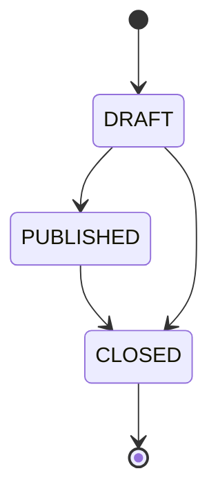
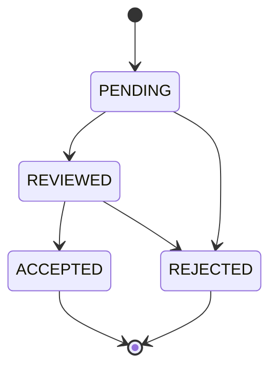
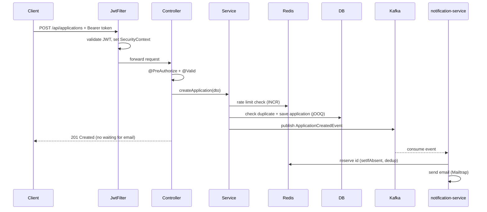
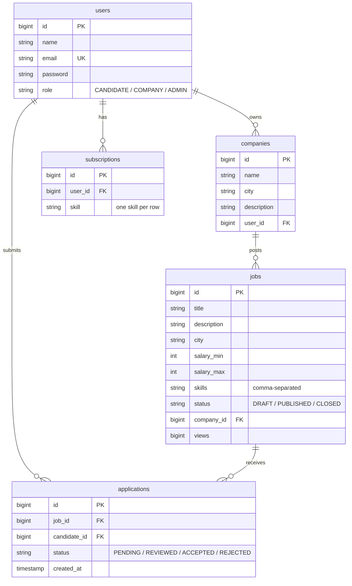

# JobFlow

A job board platform built as a portfolio project to demonstrate production-ready backend development with Java and Spring Boot. Two microservices communicating asynchronously over Kafka — covering the full backend stack: security, domain logic, caching, full-text search, event-driven messaging, observability, and testing.

---

## Tech Stack

| Layer | Technology |
|---|---|
| Language | Java 21 |
| Framework | Spring Boot 4.1.0 |
| API | Spring Web (REST) |
| Database | PostgreSQL + jOOQ (no JPA/Hibernate) |
| Migrations | Liquibase |
| Caching | Redis (Spring Data Redis) |
| Search | Elasticsearch (full-text + filters) |
| Messaging | Apache Kafka (producer + consumer) |
| Email | Mailtrap (SMTP sandbox) |
| Security | Spring Security + JWT (jjwt 0.12.6, stateless) |
| Docs | Springdoc OpenAPI 2.3.0 (Swagger UI) |
| Observability | Spring Boot Actuator + AOP logging (SLF4J/Logback) |
| Infrastructure | Docker Compose (Postgres, Redis, Kafka, Elasticsearch) |
| Testing | JUnit 5, Mockito, Spring MVC Test (MockMvc) |

> **Why jOOQ instead of JPA?** jOOQ gives full control over SQL — no N+1 problems, no hidden queries, no magic. Every query is explicit and type-safe (classes are generated from the live DB schema, so a wrong column name fails at compile time).

---

## Services

| Service | Port | Responsibility |
|---|---|---|
| `jobflow-job-service` | 8080 | Core domain — auth, jobs, companies, applications, subscriptions, search, caching |
| `notification-service` | 8081 | Kafka consumer — sends email notifications on new applications |

The two services are **decoupled via Kafka**: the job-service publishes an event when an application is created; the notification-service consumes it and sends an email. If the notification-service is down, the job-service keeps working — events wait in Kafka.

---

## Features

- **Auth** — register and login with a JWT token response (stateless, BCrypt-hashed passwords)
- **Role-based access** — `CANDIDATE`, `COMPANY`, `ADMIN`, enforced via `@PreAuthorize` on every controller
- **Job lifecycle** — companies create, update, publish, and close job postings (`DRAFT → PUBLISHED → CLOSED`)
- **Applications** — candidates apply to jobs; each application triggers an async email; status flow `PENDING → REVIEWED → ACCEPTED / REJECTED`
- **Company management** — create, update, delete companies with duplicate-name protection
- **Skill subscriptions** — candidates subscribe to skills (one skill per subscription) drawn from real job postings
- **Redis caching** — read-by-id endpoints cached with per-region TTL and automatic invalidation on write
- **Rate limiting** — Redis fixed-window limiter guards login (brute-force) and application creation (spam) — `INCR + EXPIRE`, fail-open
- **View counter** — job views counted in Redis (`INCR`), flushed to Postgres on a schedule via `GETDEL` (no lost counts)
- **Full-text search** — Elasticsearch `multi_match` over title/description/skills + dynamic `term`/`range` filters (city, status, salary)
- **Distinct skills endpoint** — aggregates all skills across postings for the subscription UI
- **Event-driven email** — Kafka producer on application creation → consumer → Mailtrap, with idempotent de-duplication (Redis reserve + release, at-least-once safe)
- **Global error handling** — `ResourceNotFoundException → 404`, `DuplicateResourceException → 409`, validation → `400`, rate limit → `429`, catch-all → `500` (stack trace logged, generic message returned)
- **Observability** — Actuator health/metrics + an AOP `@Around` aspect logging every service call (entry/exit/duration) to a rotating file

---

## Architecture

```mermaid
graph TD
    Client -->|HTTP + JWT Bearer| Filter[JwtFilter<br/>validate token, set SecurityContext]
    Filter --> Controller[REST Controllers<br/>@PreAuthorize + @Valid]
    Controller -->|delegates| Service[Service Layer<br/>@Transactional business logic]
    Service -->|type-safe SQL| Repository[Repository Layer<br/>jOOQ / DSLContext]
    Repository --> PostgreSQL[(PostgreSQL<br/>schema via Liquibase)]
    Service -->|@Cacheable / @CacheEvict| Redis[(Redis<br/>cache + rate limit + views)]
    Service -->|full-text search| Elasticsearch[(Elasticsearch)]
    Service -->|ApplicationCreatedEvent| Kafka[[Kafka topic<br/>application-created]]
    Kafka --> Consumer[notification-service<br/>@KafkaListener]
    Consumer -->|idempotent dedup via Redis| Email[Email via Mailtrap]
    Client -->|no auth| Actuator[/actuator/health/]
```

---

## Job Status State Machine



## Application Status State Machine



---

## Request Flow — Applying to a Job



---

## Getting Started

**Prerequisites:** Docker Desktop, Java 21, Maven

```bash
# 1. Clone the repository
git clone https://github.com/qqrayzqq/JobFlow.git
cd JobFlow

# 2. Start infrastructure (Postgres, Redis, Kafka, Elasticsearch)
docker compose up -d

# 3. Run the job-service (Liquibase migrations run automatically on startup)
cd jobflow-job-service
./mvnw spring-boot:run

# 4. In another terminal, run the notification-service
cd notification-service
mvn spring-boot:run
```

- Swagger UI: `http://localhost:8080/swagger-ui/index.html`
- Health check: `http://localhost:8080/actuator/health`

> **Note:** the job-service uses jOOQ code generation against the live database, so Postgres must be running before the build (`docker compose up -d postgres`).

---

## REST API Overview

| Method | Endpoint | Access | Description |
|---|---|---|---|
| `POST` | `/api/auth/register` | public | Register, returns JWT |
| `POST` | `/api/auth/login` | public | Login, returns JWT |
| `POST` | `/api/jobs` | `COMPANY` | Create a job posting |
| `PUT` | `/api/jobs/{id}` | `COMPANY` | Update a job |
| `DELETE` | `/api/jobs/{id}` | `COMPANY`/`ADMIN` | Delete a job |
| `GET` | `/api/jobs/{id}` | public | Get a job (increments views) |
| `GET` | `/api/jobs/search?q=&city=&status=&minSalary=&maxSalary=` | public | Full-text search (Elasticsearch) |
| `GET` | `/api/jobs/skills` | public | All distinct skills |
| `POST` | `/api/jobs/reindex` | `ADMIN` | Backfill Postgres → Elasticsearch |
| `POST` | `/api/applications` | `CANDIDATE` | Apply to a job (triggers email) |
| `PATCH` | `/api/applications/{id}/status` | `COMPANY` | Update application status |
| `POST` | `/api/companies` | `COMPANY` | Create a company |
| `POST` | `/api/subscriptions` | `CANDIDATE` | Subscribe to a skill |

### Example — register

```bash
curl -X POST http://localhost:8080/api/auth/register \
  -H "Content-Type: application/json" \
  -d '{"name":"John","email":"john@example.com","password":"secret123","role":"CANDIDATE"}'
# → { "token": "eyJhbGciOiJ..." }
```

### Example — search jobs

```bash
curl "http://localhost:8080/api/jobs/search?q=java&city=Praha&minSalary=1000"
```

---

## Security Model

All endpoints require `Authorization: Bearer <token>` except `register`, `login`, and public `GET /api/jobs/**`.

| Role | Access |
|---|---|
| `CANDIDATE` | Apply to jobs, manage own applications, subscribe to skills |
| `COMPANY` | Manage own companies and job postings, review applications |
| `ADMIN` | Full access (delete jobs, trigger reindex) |

JWT is **stateless** — the token carries the identity and roles, signed with a secret; the server stores no session. `@PreAuthorize` enforces roles at the method level via Spring AOP.

---

## Testing

```
Unit tests (JUnit 5 + Mockito) — business logic in isolation
  RateLimiterServiceTest    IdempotencyServiceTest   ApplicationServiceTest
  AuthServiceTest           CompanyServiceTest       SubscriptionServiceTest
  ViewCounterServiceTest    JobServiceTest

Web-layer tests (@WebMvcTest + MockMvc) — HTTP status, JSON, validation, error mapping
  JobControllerTest         AuthControllerTest
```

```bash
# from jobflow-job-service (Postgres must be running for jOOQ codegen)
./mvnw test
```

Tests follow the pyramid: many fast unit tests, fewer web-slice tests, integration tests (Testcontainers) planned. Mockito verifies both return values (`assertThat`) and side effects (`verify`) — e.g. that an application publishes a Kafka event and that passwords are hashed before saving.

---

## Database Schema

Managed by Liquibase migrations.



- **Users** — roles `CANDIDATE` / `COMPANY` / `ADMIN`
- **Jobs** — statuses `DRAFT` / `PUBLISHED` / `CLOSED`; skills stored as comma-separated text
- **Applications** — statuses `PENDING` / `REVIEWED` / `ACCEPTED` / `REJECTED`
- **Subscriptions** — one row per skill (not comma-separated)

---

## Roadmap

- [ ] Integration tests with Testcontainers (real Postgres / Redis / Kafka / Elasticsearch)
- [ ] CI/CD pipeline (GitHub Actions + secrets)
- [ ] Multi-stage Dockerfiles + `env_file` secrets + dev/prod Spring profiles
- [ ] Access + refresh token rotation with revocation
- [ ] Kafka type mapping (aliases) for future status events

---

## What I Learned Building This

- Writing type-safe SQL with jOOQ (code generation from the live schema, no ORM magic)
- Designing a stateless JWT security chain from scratch (filter → SecurityContext → method security)
- Decoupling services with Kafka and making the consumer idempotent (at-least-once → reserve + release dedup in Redis)
- Keeping Elasticsearch in sync with Postgres as a derived search index, and understanding the dual-write problem
- Using Redis for three distinct jobs: caching, rate limiting (fixed-window), and a write-buffered view counter
- Centralized error handling and cross-cutting logging via AOP (`@Around` proxy)
- Testing at multiple layers — unit (Mockito) and web-slice (`@WebMvcTest` + MockMvc) — and knowing what is worth testing vs. what is framework noise
